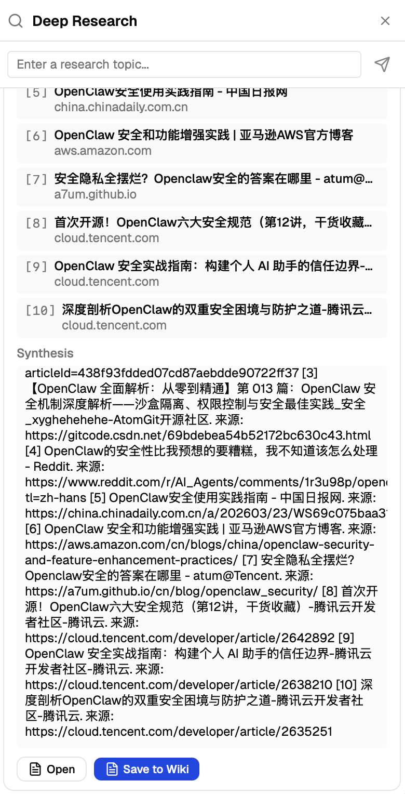
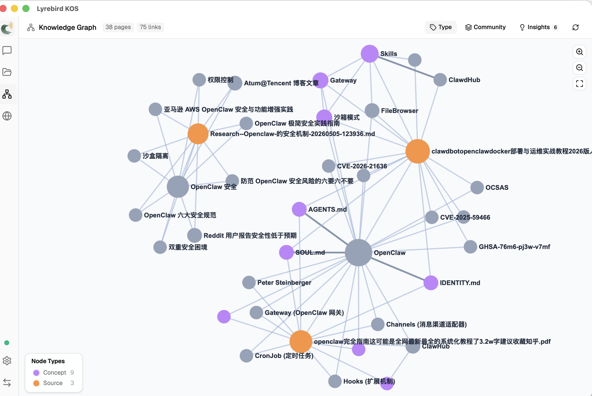

# KnowledgeOS 🧠

<p align="center">
  
</p>

<p align="center">
  <strong>Enterprise-grade Next-generation Intelligent Knowledge OS: Integration of Deep Research, Knowledge Graphs, and Hybrid RAG</strong>
</p>

<p align="center">
  <a href="./LICENSE"></a>
  <a href="#"></a>
  <a href="#"></a>
  <a href="#"></a>
</p>

<p align="center">
  English | <a href="./README_zh.md">简体中文</a>
</p>

---

## 🌟 The Vision

In the era of enterprise knowledge management, we face the dual challenges of **"Data Silos"** and **"Knowledge Hallucination"**. Traditional RAG (Retrieval-Augmented Generation) is often limited by shallow semantic matching and fails to understand the deep topological relationships between pieces of knowledge.

**KnowledgeOS** aims to break the deadlock of "dead documents, unsearchable data, and lack of correlation." We innovatively combine the deep interaction philosophy of **LLM-Wiki** with the zero-hallucination static analysis of **Graphify** to build a dynamically growing, reasoning-capable enterprise knowledge brain. It is not just a repository, but a self-evolving intelligent operating system.

---

## ✨ Key Features

### 🔐 1. SaaS-Level Project Isolation
Designed for B2B commercial scenarios. Based on a rigorous authentication system for Tenants and Users, it achieves complete physical isolation of data at the **Project-Level**.
- **Physical Isolation**: Documents, vector indices, and knowledge graphs of different projects are completely independent at the storage layer.
- **Security & Sovereignty**: Ensures data sovereignty between different departments and project teams within an enterprise.

### 🚄 2. Hybrid Ingestion Engine
The system automatically adopts the most suitable processing track for different data streams:
- **Static Analysis Track (Code/Structured)**: Utilizes `Tree-sitter` (AST) to statically parse code and structured data with **0 Token consumption**. It extracts definitions and references with precision, completely eliminating LLM hallucinations.
- **Semantic Reasoning Track (Unstructured)**: For PDFs, Word docs, and web pages, it employs a **2-Step Chain-of-Thought (CoT)**: first analyzing conceptual conflicts, then generating logical relations, transforming dead text into a living knowledge web.
- **Multi-Media Track (Audio/Video)**: YouTube and Bilibili videos are transcribed via `Faster-Whisper + yt-dlp`, then fed into the semantic pipeline for deep knowledge extraction.

### 🌐 3. Multi-Platform URL Ingestion (NEW v0.5.6)
One-click content extraction from anywhere on the web via a three-level intelligent fetch chain:
- **Supported Platforms**: YouTube, Bilibili, Zhihu, WeChat Official Accounts, X/Twitter, arXiv, and any web page.
- **Three-Level Fetch Chain**: `trafilatura` (static extraction) → `Jina Reader` (cloud Playwright with JS rendering) → `Tavily Extract` (backup).
- **Cookie Management**: Centrally manage platform authentication cookies via the Admin Web dashboard (supports Header String and Netscape formats).
- **Source Traceability**: Original URLs are saved to the database, enabling one-click browser access to the source material.

### 🔀 4. LiteLLM Hybrid Model Routing
Integrated with **LiteLLM** gateway to balance cost and intelligence:
- **Smart Dispatching**: Step 1 (coarse analysis) uses cost-effective models (e.g., DeepSeek), while Step 2 (deep graph reasoning) utilizes top-tier models (e.g., Gemini 1.5 Pro / Claude 3.5).
- **Privacy Mode**: Supports locally deployed **Ollama**, ensuring core confidential data never leaves your network.

### 🤖 5. Deep Research Agent
A built-in Agent with "curiosity." When the LLM identifies knowledge gaps during document analysis, it automatically triggers deep research:
- **Autonomous Exploration**: Automatically executes web crawling to compare the latest industry information.
- **Persistence of History**: All research reports are saved as Markdown, with real-time status streaming in the UI, and allow for secondary editing and ingestion at any time.

<p align="center">
  
  <br>
  <em>Autonomous Deep Search and Real-time Ingestion Interface</em>
</p>

### 🛡️ 6. Maker-Checker Audit Pipeline
Drawing inspiration from the rigor of the financial industry, we introduce a **Maker-Checker mechanism**.
- **Quality Gate**: Knowledge nodes generated by LLMs must pass through an expert Audit Pipeline before being injected into the enterprise public vector pool.
- **Anti-Explosion**: Effectively filters out low-quality, duplicate, or conflicting information to maintain the absolute purity of the knowledge base.

### ⚡ 7. High-Performance Graph Rendering & SSE Streaming
- **Smooth Experience**: Based on `Sigma.js` and graph pruning algorithms, achieving lightning-fast zooming and searching even with tens of thousands of nodes.
- **Real-time Transparency**: Uses `Redis + SSE` protocols to stream every step of the LLM's thinking, crawling, and parsing status to the frontend UI in real-time, eliminating "black box" waiting.

<p align="center">
  
  <br>
  <em>Real-time Knowledge Graph Topology Rendering</em>
</p>

---

## 🏗️ Technical Architecture (C/S)

### **Backend (KnowledgeOS-Server)**
- **Core Framework**: `Python 3.12` + `FastAPI` + `Celery` (Distributed Task Queue)
- **Data Storage**: 
  - `PostgreSQL`: Relational data, user status, and cookie management.
  - `LanceDB`: Next-gen Serverless vector database for extreme project isolation.
  - `Redis`: Task scheduling and SSE log relay.
- **Content Extraction**:
  - `trafilatura` + `Faster-Whisper` + `yt-dlp` for local pipeline processing.
  - `Jina Reader` + `Tavily Extract` for cloud-based JS rendering fallback.
- **Deployment**: Fully containerized, supporting `Docker Compose` one-click startup.

### **Frontend (KnowledgeOS-Client)**
- **Stack**: `Tauri v2` + `React 19` + `Vite` + `Tailwind CSS`
- **Visualization**: `Sigma.js` + `Graphology`

---

## 🚀 Quick Start

### 📚 Resources
- [API Documentation (v0.5.6)](./docs/API.md)
- [Changelog](./docs/CHANGELOG.md)
- [Multi-Platform URL Ingestion Plan](./多源URL内容获取架构规划.md) (Chinese)

### 1. Backend Deployment (Docker)
Please refer to the [Deployment Guide](./部署运行.md) for configuration.
```bash
cd server
cp .env.example .env  # Fill in your API Keys
docker compose up -d
docker exec -it kos_api python init_db.py
```

### 2. Admin Web & Configuration
Access `http://localhost:8080/admin` to manage:
- **Model Configuration**: Set API keys and model routing (Chat, Wiki Engine, Translator)
- **Platform Cookies**: Manage authentication cookies for YouTube, Zhihu, Bilibili etc.
- **Shared Projects**: Publish knowledge base packages and manage tenant access

### 3. Client Execution (Local)
```bash
cd client
npm install
npm run tauri dev
```

---

## 🤝 Acknowledgments

The development of KnowledgeOS is deeply inspired by the open-source community. Special thanks to the following projects for their inspiration and code contributions:

- [**LLM-Wiki**](https://github.com/nashsu/llm_wiki): Provided the core CoT logic for knowledge extraction and the frontend interaction architecture.
- [**Graphify**](https://github.com/safishamsi/graphify): Provided high-performance static code analysis and structured definition references.

---

## 📜 License

This project is licensed under the **[GNU General Public License v3.0](./LICENSE)**.

*KnowledgeOS - Guarding Data Sovereignty, Building Private Brains*
